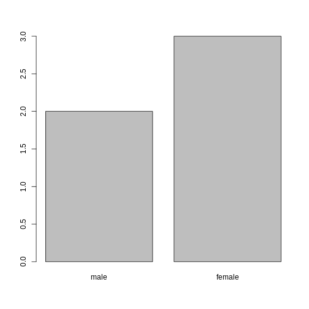

::::::::::::::::::::::::::::::::::::::: objectives

- `data.frame` の概念について説明してください。
- .csv ファイルから外部データを読み込み、データフレームに格納する方法を示してください。
- データフレームの内容を要約する方法を説明してください。
- 因子（factor）の概念について説明してください。
- 文字列と因子間の変換方法を示してください。
- 因子の順序変更と名前変更の方法を説明してください。
- 日付のフォーマット方法を示してください。
- データのエクスポートと保存方法について説明してください。

::::::::::::::::::::::::::::::::::::::::::::::::::

:::::::::::::::::::::::::::::::::::::::: questions

- Rによる最初のデータ分析

::::::::::::::::::::::::::::::::::::::::::::::::::

> このエピソードは、Data Carpentriesの_Data Analysis and
> Visualisation in R for Ecologists_レッスンに基づいています。

## 遺伝子発現データの説明

本研究では、[Blackmoreら（2017）](https://www.ncbi.nlm.nih.gov/pmc/articles/PMC5544260/)が公表したデータの一部を使用します。論文タイトルは『上気道感染症が中枢神経系のトランスクリプトーム変化に及ぼす影響』です。この研究の目的は、上気道感染症が感染後の小脳および脊髄におけるRNA転写変化に及ぼす影響を明らかにすることでした。性別を一致させた8週齢のC57BL/6マウスを用い、生理食塩水またはインフルエンザA型ウイルスを経鼻投与し、感染0日目、4日目、および8日目における小脳および脊髄組織のトランスクリプトーム変化をRNA-seq法で評価しました。

データセットはカンマ区切り値（CSV）ファイルとして保存されています。各行は単一のRNA発現測定値に関する情報を保持しており、最初の11列は以下の項目を表します：

| 列名       | 説明                                                                                  |
| ---------- | -------------------------------------------------------------------------------------- |
| gene       | 測定対象とした遺伝子名                                                                       |
| sample     | 遺伝子発現測定を実施したサンプル名                                                   |
| expression | 遺伝子発現値                                                                             |
| organism   | 生物種/分類群 - 本データはすべてマウス由来です                                          |
| age        | マウスの年齢（すべてのマウスは8週齢）                                                    |
| sex        | マウスの性別                                                                         |
| infection  | マウスの感染状態 - インフルエンザA型に感染しているか否か                              |
| strain     | インフルエンザA型の株                                                                      |
| time       | 感染期間（日数）                                                                     |
| tissue     | 遺伝子発現実験に使用した組織 - 小脳または脊髄                                         |
| mouse      | マウスの一意識別子                                                                       |

遺伝子発現データを含むCSVファイルのダウンロードにはR関数`download.file()`を使用し、取得したCSVファイルの内容を`read.csv()`でメモリ上に`data.frame`クラスのオブジェクトとして読み込みます。`download.file()`コマンドの第1引数にはソースURLを指定する文字列を指定します。このURLはGitHubリポジトリからCSVファイルをダウンロードします。カンマの後に続くテキスト（`"data/rnaseq.csv"`）が、ローカルマシン上のファイル保存先パスとなります。事前に`"data"`という名前のフォルダを作成しておく必要があります。このコマンドはリモートファイルをダウンロードし、`"rnaseq.csv"`という名前を付けて既存の`"data"`フォルダに追加します。


``` r
download.file(url = "https://github.com/carpentries-incubator/bioc-intro/raw/main/episodes/data/rnaseq.csv",
              destfile = "data/rnaseq.csv")
```

これでデータの読み込み準備が整いました。以下のようにデータを読み込めます：


``` r
rna <- read.csv("data/rnaseq.csv")
```

このコマンドは出力を表示しません。これは割り当て操作自体が出力を生成しないためです。データが正しく読み込まれたことを確認するには、データフレームの名前を直接入力してその内容を確認できます：


``` r
rna
```

うわっ…かなりの量の出力ですね。少なくともデータが正常に読み込まれたことを示しています。`head()`関数を使用してこのデータフレームの先頭6行を確認してみましょう：


``` r
head(rna)
```

``` output
     gene     sample expression     organism age    sex  infection  strain time
1     Asl GSM2545336       1170 Mus musculus   8 Female InfluenzaA C57BL/6    8
2    Apod GSM2545336      36194 Mus musculus   8 Female InfluenzaA C57BL/6    8
3 Cyp2d22 GSM2545336       4060 Mus musculus   8 Female InfluenzaA C57BL/6    8
4    Klk6 GSM2545336        287 Mus musculus   8 Female InfluenzaA C57BL/6    8
5   Fcrls GSM2545336         85 Mus musculus   8 Female InfluenzaA C57BL/6    8
6  Slc2a4 GSM2545336        782 Mus musculus   8 Female InfluenzaA C57BL/6    8
      tissue mouse ENTREZID
1 Cerebellum    14   109900
2 Cerebellum    14    11815
3 Cerebellum    14    56448
4 Cerebellum    14    19144
5 Cerebellum    14    80891
6 Cerebellum    14    20528
                                                                       product
1                               argininosuccinate lyase, transcript variant X1
2                                       apolipoprotein D, transcript variant 3
3 cytochrome P450, family 2, subfamily d, polypeptide 22, transcript variant 2
4                         kallikrein related-peptidase 6, transcript variant 2
5                Fc receptor-like S, scavenger receptor, transcript variant X1
6          solute carrier family 2 (facilitated glucose transporter), member 4
     ensembl_gene_id external_synonym chromosome_name   gene_biotype
1 ENSMUSG00000025533    2510006M18Rik               5 protein_coding
2 ENSMUSG00000022548             <NA>              16 protein_coding
3 ENSMUSG00000061740             2D22              15 protein_coding
4 ENSMUSG00000050063             Bssp               7 protein_coding
5 ENSMUSG00000015852    2810439C17Rik               3 protein_coding
6 ENSMUSG00000018566           Glut-4              11 protein_coding
                            phenotype_description
1           abnormal circulating amino acid level
2                      abnormal lipid homeostasis
3                        abnormal skin morphology
4                         abnormal cytokine level
5 decreased CD8-positive alpha-beta T cell number
6              abnormal circulating glucose level
  hsapiens_homolog_associated_gene_name
1                                   ASL
2                                  APOD
3                                CYP2D6
4                                  KLK6
5                                 FCRL2
6                                SLC2A4
```

``` r
## 以下の方法もお試しください
## View(rna)
```

**注意**

`read.csv()`関数はデフォルトでカンマをフィールド区切り文字として認識しますが、一部の国ではカンマが小数点区切りとして使用され、セミコロン（;）がフィールド区切り文字として用いられています。このような形式のファイルをRで読み込む場合は、`read.csv2()`関数を使用できます。この関数は`read.csv()`と完全に同様の動作をしますが、小数点区切り文字とフィールド区切り文字のパラメータが異なります。別の形式のファイルを扱う場合、これらの区切り文字はユーザーが指定可能です。詳細な情報については、`?read.csv`と入力してヘルプを参照してください。タブ区切りデータファイルを読み込む場合は`read.delim()`関数も利用可能です。これらの関数はすべて、異なる引数を持つ主要な`read.table()`関数のラッパー関数であることに注意が必要です。したがって、前述のデータは`read.table()`関数を使用し、区切り文字として`,`を指定することでも読み込むことができます。以下がそのコード例です：


``` r
rna <- read.table(file = "data/rnaseq.csv",
                  sep = ",",
                  header = TRUE)
```

`header`引数はデフォルトで`read.table()`が`FALSE`に設定されているため、ヘッダーを正しく読み込むためには`TRUE`に設定する必要があります。


## データフレームとは？

データフレームは、ほとんどの表形式データにおいて事実上の標準データ構造であり、統計処理やグラフ作成の際に用いられる基本的なデータ形式です。

データフレームは手動で作成することも可能ですが、実際には`read.csv()`や`read.table()`といった関数を用いて作成されることが一般的です。つまり、ハードディスクやウェブ上のスプレッドシートデータをインポートする際に生成される形式です。

データフレームとは、列がすべて同じ長さのベクトルで構成される表形式のデータ表現です。列がベクトルであるため、各列には単一のデータ型（例：文字列、整数、因子など）のみが含まれます。例えば、以下の図は数値型、文字列型、論理型のベクトルで構成されるデータフレームの概念図です。

<div class="figure" style="text-align: center">

<p class="caption">データフレームの概念的表現</p>
</div>


データフレームの<b>構造</b>を`str()`関数で確認すると、この概念が明確に理解できます：


``` r
str(rna)
```

``` output
'data.frame':	32428 obs. of  19 variables:
 $ gene                                 : chr  "Asl" "Apod" "Cyp2d22" "Klk6" ...
 $ sample                               : chr  "GSM2545336" "GSM2545336" "GSM2545336" "GSM2545336" ...
 $ expression                           : int  1170 36194 4060 287 85 782 1619 288 43217 1071 ...
 $ organism                             : chr  "Mus musculus" "Mus musculus" "Mus musculus" "Mus musculus" ...
 $ age                                  : int  8 8 8 8 8 8 8 8 8 8 ...
 $ sex                                  : chr  "Female" "Female" "Female" "Female" ...
 $ infection                            : chr  "InfluenzaA" "InfluenzaA" "InfluenzaA" "InfluenzaA" ...
 $ strain                               : chr  "C57BL/6" "C57BL/6" "C57BL/6" "C57BL/6" ...
 $ time                                 : int  8 8 8 8 8 8 8 8 8 8 ...
 $ tissue                               : chr  "Cerebellum" "Cerebellum" "Cerebellum" "Cerebellum" ...
 $ mouse                                : int  14 14 14 14 14 14 14 14 14 14 ...
 $ ENTREZID                             : int  109900 11815 56448 19144 80891 20528 97827 118454 18823 14696 ...
 $ product                              : chr  "argininosuccinate lyase, transcript variant X1" "apolipoprotein D, transcript variant 3" "cytochrome P450, family 2, subfamily d, polypeptide 22, transcript variant 2" "kallikrein related-peptidase 6, transcript variant 2" ...
 $ ensembl_gene_id                      : chr  "ENSMUSG00000025533" "ENSMUSG00000022548" "ENSMUSG00000061740" "ENSMUSG00000050063" ...
 $ external_synonym                     : chr  "2510006M18Rik" NA "2D22" "Bssp" ...
 $ chromosome_name                      : chr  "5" "16" "15" "7" ...
 $ gene_biotype                         : chr  "protein_coding" "protein_coding" "protein_coding" "protein_coding" ...
 $ phenotype_description                : chr  "abnormal circulating amino acid level" "abnormal lipid homeostasis" "abnormal skin morphology" "abnormal cytokine level" ...
 $ hsapiens_homolog_associated_gene_name: chr  "ASL" "APOD" "CYP2D6" "KLK6" ...
```

## データフレームオブジェクトの検査

すでに`head()`関数と`str()`関数がデータフレームの内容と構造を確認するのに有用であることを説明しました。以下に、データの内容/構造を把握するための代表的な関数を非網羅的に紹介します。実際に試してみましょう！

**サイズ情報**:

- `dim(rna)` - 行数を第1要素、列数を第2要素とするベクトルを返します（オブジェクトの**次元**情報）。
- `nrow(rna)` - 行数を返します。
- `ncol(rna)` - 列数を返します。

**内容情報**:

- `head(rna)` - 最初の6行を表示します。
- `tail(rna)` - 最後の6行を表示します。

**名前情報**:

- `names(rna)` - 列名を返します（`data.frame`オブジェクトの場合、`colnames()`関数と同じ機能です）。
- `rownames(rna)` - 行名を返します。

**要約情報**:

- `str(rna)` - オブジェクトの構造と、各列のクラス、長さ、内容に関する情報を提供します。
- `summary(rna)` - 各列に対する要約統計量を表示します。

注記: これらの関数の多くは「汎用関数」であり、`data.frame`以外の他のデータ型に対しても使用できます。

:::::::::::::::::::::::::::::::::::::::  challenge

## 課題：

`str(rna)` の出力結果に基づいて、以下の質問に答えてください：

- オブジェクト `rna` のクラスは何ですか？
- このオブジェクトには行がいくつ、列がいくつありますか？

:::::::::::::::  solution

## 解法

- class: データフレーム
- 行数: 32428、列数: 19

:::::::::::::::::::::::::

::::::::::::::::::::::::::::::::::::::::::::::::::

## データフレームの索引付けと部分抽出

`rna` データフレームは行と列を持つ2次元構造です。特定のデータを抽出する場合、取得したい「座標」を明示的に指定する必要があります。まず行番号を指定し、その後に列番号を指定します。ただし、これらの座標を指定する方法によって結果のクラスが異なる点に注意してください。


``` r
# データフレームの最初の行・最初の列の要素（ベクトルとして）
rna[1, 1]
# データフレームの6番目の列の最初の要素（ベクトルとして）
rna[1, 6]
# データフレームの最初の列全体（ベクトルとして）
rna[, 1]
# データフレームの最初の列全体（データフレームとして）
rna[1]
# データフレームの7番目の列の最初の3要素（ベクトルとして）
rna[1:3, 7]
# データフレームの3行目全体（データフレームとして）
rna[3, ]
# head_rna <- head(rna) と同等
head_rna <- rna[1:6, ]
head_rna
```

`:` は特殊な関数で、整数の数値ベクトルを昇順または降順で生成します。例えば `1:10` や `10:1` のように使用します。詳細はセクション@ref(sec:genvec)を参照してください。

また、"`-`" 記号を使用してデータフレームの特定のインデックスを除外することも可能です：


``` r
rna[, -1]          ## 最初の列を除いたデータフレーム全体
rna[-c(7:66465), ] ## head(rna) と同等
```

データフレームの部分抽出は、前述のようにインデックスを指定する方法のほか、列名を直接指定する方法でも行えます：


``` r
rna["gene"]       # 結果はデータフレーム
rna[, "gene"]     # 結果はベクトル
rna[["gene"]]     # 結果はベクトル
rna$gene          # 結果はベクトル
```

RStudioでは、自動補完機能を利用することで、列の完全かつ正確な名前を簡単に取得できます。

:::::::::::::::::::::::::::::::::::::::  challenge

## 課題

1. `rna` データセットの200行目のみを含む `data.frame` オブジェクト `rna_200` を作成してください。

2. `nrow()` 関数が `data.frame` の行数を返す仕組みに注目してください。

- この行数を利用して、初期の `rna` データフレームから最後の行だけを抽出してください。

- `tail()` 関数で表示される最後の行と比較し、期待通りの結果が得られていることを確認してください。

- 行番号ではなく、`nrow()` 関数を使って最後の行を抽出してください。

- この最後の行から新しいデータフレーム `rna_last` を作成してください。

3. `nrow()` 関数を使用して、`rna` データフレームの中央に位置する行を抽出してください。この行の内容を `rna_middle` という名前のオブジェクトに格納してください。

4. `nrow()` 関数と前述の `-` 表記を組み合わせて、`head(rna)` 関数と同様の動作を実現し、`rna` データセットの最初の6行のみを保持してください。

:::::::::::::::  solution

## 解答


``` r
## 1.
rna_200 <- rna[200, ]
## 2.
## 可読性向上と重複削減のため `n_rows` を保存
n_rows <- nrow(rna)
rna_last <- rna[n_rows, ]
## 3.
rna_middle <- rna[n_rows / 2, ]
## 4.
rna_head <- rna[-(7:n_rows), ]
```

:::::::::::::::::::::::::

::::::::::::::::::::::::::::::::::::::::::::::::::

## Factors

因子は**カテゴリカルデータ**を表します。これらはラベルと関連付けられた整数として格納され、順序付きまたは順序なしのいずれかとして扱うことができます。
因子は見た目（そして多くの場合動作も）文字ベクトルのように見えますが、Rでは実際には整数ベクトルとして扱われます。したがって、文字列として扱う際には細心の注意が必要です。

一度作成された因子は、事前に定義された値のセット（*レベル*と呼ばれる）のみを含むことができます。デフォルトでは、Rは常にレベルをアルファベット順に並べ替えます。例えば、2つのレベルを持つ因子がある場合：


``` r
sex <- factor(c("male", "female", "female", "male", "female"))
```

Rはレベル `"female"` に `1` を、レベル `"male"` に `2` を割り当てます（このベクトルの最初の要素が `"male"` であっても、`f` は `m` よりもアルファベット順で先に来るため）。`levels()` 関数を使用するとこの割り当てを確認でき、`nlevels()` でレベルの総数を取得できます：


``` r
levels(sex)
```

``` output
[1] "female" "male"  
```

``` r
nlevels(sex)
```

``` output
[1] 2
```

因子の順序が重要でない場合もありますが、意味的な意味を持つ場合（例：「低」「中」「高」）、可視化が向上する場合、あるいは特定の分析手法で必要とされる場合には、順序を指定したいことがあります。ここでは、`sex` ベクトルのレベル順序を並べ替える方法の一例を示します：


``` r
sex ## 現在の順序
```

``` output
[1] male   female female male   female
Levels: female male
```

``` r
sex <- factor(sex, levels = c("male", "female"))
sex ## 順序変更後
```

``` output
[1] male   female female male   female
Levels: male female
```

Rのメモリ内では、これらの因子は整数（1, 2, 3）として表現されますが、因子は自己記述的であるため整数よりも情報量が豊富です：`"female"` や `"male"` というラベルは、`1` や `2` という数値よりもはるかに説明的です。どちらが「男性」を表すのか、整数値だけでは判断できません。一方、因子にはこの情報が組み込まれています。特にレベル数が多い場合（例：本例の遺伝子バイオタイプ）にこの機能は非常に有用です。

データが因子として格納されている場合、`plot()` 関数を使用することで、各因子レベルが表す観測値の数を素早く把握できます。ここでは、データ内の男性と女性の数を確認してみましょう。


``` r
plot(sex)
```

<div class="figure" style="text-align: center">

<p class="caption">女性と男性の数を示す棒グラフ</p>
</div>

### 因子を文字ベクトルに変換する場合

因子を文字ベクトルに変換する必要がある場合は、`as.character()`関数を使用します。


``` r
as.character(sex)
```

``` output
[1] "male"   "female" "female" "male"   "female"
```


<!-- ### Numeric factors -->

<!-- Converting factors where the levels appear as numbers (such as -->

<!-- concentration levels, or years) to a numeric vector is a little -->

<!-- trickier. The `as.numeric()` function returns the index values of the -->

<!-- factor, not its levels, so it will result in an entirely new (and -->

<!-- unwanted in this case) set of numbers.  One method to avoid this is to -->

<!-- convert factors to characters, and then to numbers.  Another method is -->

<!-- to use the `levels()` function. Compare: -->

<!-- ```{r} -->

<!-- year_fct <- factor(c(1990, 1983, 1977, 1998, 1990)) -->

<!-- as.numeric(year_fct)  ## Wrong! And there is no warning... -->

<!-- as.numeric(as.character(year_fct)) ## Works... -->

<!-- as.numeric(levels(year_fct))[year_fct] ## The recommended way. -->

<!-- ```

<!-- Notice that in the `levels()` approach, three important steps occur: -->

<!-- * We obtain all the factor levels using `levels(year_fct)` -->

<!-- * We convert these levels to numeric values using `as.numeric(levels(year_fct))` -->

<!-- * We then access these numeric values using the underlying integers of the -->

<!--   vector `year_fct` inside the square brackets -->

### 因子名の変更

これらの因子名を変更する場合、必要なのは因子の
水準を変更することだけです：


``` r
levels(sex)
```

``` output
[1] "male"   "female"
```

``` r
levels(sex) <- c("M", "F")
sex
```

``` output
[1] M F F M F
Levels: M F
```

``` r
plot(sex)
```


::::::::::::::::::::::::::::::::::::::  challenge

## 課題:

- 変数「F」と「M」をそれぞれ「Female」（女性）と「Male」（男性）に名称変更してください。

:::::::::::::::  solution

## 解答


``` r
levels(sex)
```

``` output
[1] "M" "F"
```

``` r
levels(sex) <- c("Male", "Female")
```

:::::::::::::::::::::::::

::::::::::::::::::::::::::::::::::::::::::::::::::

:::::::::::::::::::::::::::::::::::::::  challenge

## チャレンジだ：

read.csv()`を使ってデータフレームを作成する方法を見てきましたが、
`data.frame()`関数を使って手作業で作成することもできます。
この手作りの`data.frame\`にはいくつか間違いがある。
、それを見つけて修正することはできますか？  実験することをためらってはいけない！


``` r
animal_data <- data.frame(
       animal = c(dog, cat, sea cucumber, sea nurchin),
       feel = c("furry", "squishy", "spiny"),
       weight = c(45, 8 1.1, 0.8))
```

:::::::::::::::  solution

## ソリューション

- 動物の名前の周りに引用符がない
- "feel "欄に1つ記入がない（おそらく毛皮の動物の1つ）。
- 体重欄のコンマが1つ足りない

:::::::::::::::::::::::::

::::::::::::::::::::::::::::::::::::::::::::::::::

:::::::::::::::::::::::::::::::::::::::  challenge

## チャレンジだ：

次の
の例で、各列のクラスを予測できますか？

str(country_climate)\`を使って推測をチェックする：

- 期待通りですか？  なぜですか？ なぜだ？

- データフレームを作成する際に、最後の
  変数の後に `stringsAsFactors = TRUE` を追加してもう一度試してみてください。 今、何が起きているのか？
  stringsAsFactors`は、`read.csv()\`を使ってテキストベースの
  のスプレッドシートをRに読み込むときにも設定できる。


``` r
country_climate <- data.frame(
       country = c("Canada", "Panama", "South Africa", "Australia"),
       climate = c("cold", "hot", "temperate", "hot/temperate")、
       temperature = c(10, 30, 18, "15"),
       northern_hemisphere = c(TRUE, TRUE, FALSE, "FALSE"),
       has_kangaroo = c(FALSE, FALSE, FALSE, 1)
)
```

:::::::::::::::  solution

## ソリューション


``` r
country_climate <- data.frame(
       country = c("Canada", "Panama", "South Africa", "Australia"),
       climate = c("cold", "hot", "temperate", "hot/temperate"),
       temperature = c(10, 30, 18, "15"),
       northern_hemisphere = c(TRUE, TRUE, FALSE, "FALSE"),
       has_kangaroo = c(FALSE, FALSE, FALSE, 1)
       )
str(country_climate)
```

``` output
'data.frame':	4 obs. of  5 variables:
 $ country            : chr  "Canada" "Panama" "South Africa" "Australia"
 $ climate            : chr  "cold" "hot" "temperate" "hot/temperate"
 $ temperature        : chr  "10" "30" "18" "15"
 $ northern_hemisphere: chr  "TRUE" "TRUE" "FALSE" "FALSE"
 $ has_kangaroo       : num  0 0 0 1
```

:::::::::::::::::::::::::

::::::::::::::::::::::::::::::::::::::::::::::::::

データ型の自動変換は、時に恵みであり、時に
迷惑である。 その存在を認識し、ルールを学び、Rでインポートするデータ
がデータフレーム内で正しい型であることを再確認すること。 そうでない場合は、
データ入力中に生じたかもしれないミス（例えば、数字しか入っていないはずの列に文字が入っている）を検出するために、
を活用する。

詳しくはRStudio
チュートリアルをご覧ください。

## マトリックス

先に進む前に、データ・フレームについて学んだので、
パッケージのインストールを復習し、新しいデータ型、すなわち
`matrix` について学んでみよう。 data.frame`のように、行列は行と
列の2つの次元を持つ。 しかし大きな違いは、`行列`のすべてのセルは
同じ型でなければならないということである：numeric`、`character`、`logical`、...
その点で、行列は `data.frame` よりも `vector` に近い。

行列のデフォルトコンストラクタは `matrix` である。 行列を構成するための
の値のベクトルと、行および/または
の列数[^ncol]を取る。 下の図（
）のように、値は列に沿ってソートされる。


``` r
m <- matrix(1:9, ncol = 3, nrow = 3)
m
```

``` output
     [,1] [,2] [,3]
[1,]    1    4    7
[2,]    2    5    8
[3,]    3    6    9
```

[^ncol]: 行数か列数のどちらかだけで十分で、もう一方は値の長さから推測できる。 値と行／列の数が合わない場合に何が起こるか試してみてください。

:::::::::::::::::::::::::::::::::::::::  challenge

## チャレンジだ：

installed.packages()`という関数を使って、
あなたのコンピューターに現在インストールされているすべてのパッケージの情報を含む `文字\`行列
を作成します。 探検してみよう。

:::::::::::::::  solution

## 解決策


``` r
##
ip <- installed.packages()
head(ip)
## View(ip)
## パッケージの数
nrow(ip)
## インストールされている全てのパッケージの名前
rownames(ip)
## 各パッケージに関する情報の種類
colnames(ip)
```

:::::::::::::::::::::::::

::::::::::::::::::::::::::::::::::::::::::::::::::

テストデータとして、大規模なランダムデータ行列を作成することはしばしば有用である。 以下の練習問題は、平均0、標準偏差
1の正規分布から無作為に
データを抽出して、そのような行列を作成するものです。これは `rnorm()` 関数で行うことができます。

:::::::::::::::::::::::::::::::::::::::  challenge

## チャレンジだ：

正規分布データ
（平均0、標準偏差1）の次元1000×3の行列を作る。

:::::::::::::::  solution

## ソリューション


``` r
set.seed(123)
m <- matrix(rnorm(3000), ncol = 3)
dim(m)
```

``` output
[1] 1000    3
```

``` r
head(m)
```

``` output
            [,1]        [,2]       [,3]
[1,] -0.56047565 -0.99579872 -0.5116037
[2,] -0.23017749 -1.03995504  0.2369379
[3,]  1.55870831 -0.01798024 -0.5415892
[4,]  0.07050839 -0.13217513  1.2192276
[5,]  0.12928774 -2.54934277  0.1741359
[6,]  1.71506499  1.04057346 -0.6152683
```

:::::::::::::::::::::::::

::::::::::::::::::::::::::::::::::::::::::::::::::

## 日付の書式設定

新人（そしてベテラン！）が抱える最も一般的な問題の1つである。 Rユーザーは、
、日付と時刻の情報を、
適切で分析中に使用可能な変数に変換している。

### 表計算ソフトの日付に関する注意

スプレッドシートの日付は通常、1つの列に格納される。
これが日付を記録する最も自然な方法のように思えるが、実際には
ベストプラクティスではない。 スプレッドシート・アプリケーションは、
一見正しい方法で日付を表示する（人間の観察者には）。しかし、実際に
どのように日付を処理し、保存するかには問題があるかもしれない。 YEAR、MONTH、DAYを別々のカラムに、または
、YEARとDAY-OF-YEARを別々のカラムに保存した方が、
より安全な場合が多い。

LibreOffice、Microsoft Excel、OpenOffice、
Gnumericなどの表計算プログラム。 は、
日付のエンコード方法が異なる（そしてしばしば互換性がない）（同じプログラムであっても、バージョンやオペレーティング
システム間で）。 さらに、エクセルは日付でないものを
日付に変える
(@Zeeberg:2004)ことができる。例えば、MAR1、DEC1、
OCT4のような名前や識別子である。 そのため、全体的に日付フォーマットを避けているのであれば、
、こうした問題を特定しやすくなる。

Data CarpentryレッスンのDates as
data
セクションでは、スプレッドシートを使った日付の落とし穴について、さらなる洞察
を提供しています。

**lubridate`** パッケージの `ymd()` 関数を使用します (**tidyverse`** に属します。詳しくは
[こちら](https://www.tidyverse.org/))。 . \*\*lubridate`**は**tidyverse`\*\*のインストールの一部として
。
**`tidyverse`** (`library(tidyverse)`) をロードすると、コアパッケージ (ほとんどのデータ分析で使用される
パッケージ) がロードされます。 **`lubridate`**
しかし、コアTidyverseには属さないので、
`library(lubridate)`で明示的にロードする必要があります。

必要なパッケージをロードすることから始める：


``` r
library("lubridate")
```

ymd()`は年、月、日を表すベクトルを受け取り、
`Date`ベクトルに変換する。 Date`はRが
、日付であると認識するデータのクラスであり、そのように操作することができる。
関数が必要とする引数は柔軟であるが、ベストプラクティスとしては、"YYYY-MM-DD "としてフォーマットされた文字
ベクトルである。

日付オブジェクトを作成し、構造を調べてみよう：


``` r
my_date <- ymd("2015-01-01")
str(my_date)
```

``` output
 Date[1:1], format: "2015-01-01"
```

では、年、月、日を別々に貼り付けてみよう：


``` r
# sep は各コンポーネントを区切るために使う文字を示す
my_date <- ymd(paste("2015", "1", "1", sep = "-"))
str(my_date)
```

``` output
 Date[1:1], format: "2015-01-01"
```

それでは、典型的な日付操作
のパイプラインに慣れておこう。 以下の小さなデータには、異なる `year`、
`month`、`day` 列に日付が格納されている。


``` r
x <- data.frame(year = c(1996, 1992, 1987, 1986, 2000, 1990, 2002, 1994, 1997, 1985),
                month = c(2, 3, 10, 1, 8, 3, 4, 5, 5),
                day = c(24, 8, 1, 5, 8, 17, 13, 10, 11, 24),
                value = c(4, 5, 1, 9, 3, 8, 10, 2, 6, 7))
```

``` error
Error in data.frame(year = c(1996, 1992, 1987, 1986, 2000, 1990, 2002, : arguments imply differing number of rows: 10, 9
```

``` r
x
```

``` error
Error: object 'x' not found
```

次に、この関数を `x` データセットに適用する。 まず、`paste()` を使って、`x`
の `year`、`month`、`day` 列から
の文字ベクトルを作る：


``` r
paste(x$year, x$month, x$day, sep = "-")
```

``` error
Error: object 'x' not found
```

この文字ベクトルは `ymd()` の引数として使うことができる：


``` r
ymd(paste(x$year, x$month, x$day, sep = "-"))
```

``` error
Error: object 'x' not found
```

出来上がった `Date` ベクトルは `x` に `date` という新しいカラムとして追加することができる：


``` r
x$date <- ymd(paste(x$year, x$month, x$day, sep = "-"))
```

``` error
Error: object 'x' not found
```

``` r
str(x) # '日付'をクラスとする新しいカラムに注目。
```

``` error
Error: object 'x' not found
```

すべてが正しく機能していることを確認しよう。
新しいカラムを検査する一つの方法は、`summary()`を使うことである：


``` r
summary(x$date)
```

``` error
Error: object 'x' not found
```

ymd()`は、年、月、日を
の順番で持つことを期待している。 例えば、日、月、年があれば、
`dmy()\` が必要になる。


``` r
dmy(paste(x$day, x$month, x$year, sep = "-"))
```

``` error
Error: object 'x' not found
```

lubdridate\`は、あらゆる日付のバリエーションに対応する多くの関数を持っている。

## Rオブジェクトの概要

これまで、次元数（
）、格納できるデータの種類（
）が単一か複数かによって異なる、いくつかのタイプのRオブジェクトを見てきた：

- **vector\`**：1次元（長さがある）、1種類のデータ。
- **マトリックス\`**：2次元、単一データ型。
- **data.frame\`**：2次元、1列1型。

## リスト

まだ見ていないが、知っておくと便利なデータ型がリストだ。
、先ほどのまとめから続く：

- **`list`**: 1つの次元で、各項目は異なるデータ
  型にすることができる。

以下では、数値、文字、
行列、データフレーム、別のリストのベクトルを含むリストを作ってみよう：


``` r
l <- list(1:10, ## numeric
          letters, ## character
          installed.packages(), ## a matrix
          cars, ## a data.frame
          list(1, 2, 3)) ## a list
length(l)
```

``` output
[1] 5
```

``` r
str(l)
```

``` output
List of 5
 $ : int [1:10] 1 2 3 4 5 6 7 8 9 10
 $ : chr [1:26] "a" "b" "c" "d" ...
 $ : chr [1:161, 1:16] "abind" "askpass" "backports" "base64enc" ...
  ..- attr(*, "dimnames")=List of 2
  .. ..$ : chr [1:161] "abind" "askpass" "backports" "base64enc" ...
  .. ..$ : chr [1:16] "Package" "LibPath" "Version" "Priority" ...
 $ :'data.frame':	50 obs. of  2 variables:
  ..$ speed: num [1:50] 4 4 7 7 8 9 10 10 10 11 ...
  ..$ dist : num [1:50] 2 10 4 22 16 10 18 26 34 17 ...
 $ :List of 3
  ..$ : num 1
  ..$ : num 2
  ..$ : num 3
```

リストのサブセットは `[]` を使って新しいサブリストをサブセットするか、`[]]`
を使ってそのリストの単一要素を取り出す（
リストに名前がついている場合は、インデックスか名前を使う）。


``` r
l[[1]]##
```

``` output
 [1]  1  2  3  4  5  6  7  8  9 10
```

``` r
l[1:2] ## 長さ 2 のリスト
```

``` output
[[1]]
 [1]  1  2  3  4  5  6  7  8  9 10

[[2]]
 [1] "a" "b" "c" "d" "e" "f" "g" "h" "i" "j" "k" "l" "m" "n" "o" "p" "q" "r" "s"
[20] "t" "u" "v" "w" "x" "y" "z"
```

``` r
l[1] ## 長さ 1 のリスト
```

``` output
[[1]]
 [1]  1  2  3  4  5  6  7  8  9 10
```

## 表形式データのエクスポートと保存 {#sec:exportandsave}

`read.table` ファミリーの関数を使って、テキストベースのスプレッドシートをRに読み込む方法を見てきた。 data.frame`を
テキストベースのスプレッドシートにエクスポートするには、
関数の `write.table` セット（`write.csv`, `write.delim`, ...）を使用します。 これらはすべて、
エクスポートする変数と、エクスポートするファイルを指定する。 例えば、
`rna`のデータを`data_output`ディレクトリの`my_rna.csv\` ファイルにエクスポートするには、次のように実行する：


``` r
write.csv(rna, file = "data_output/my_rna.csv")
```

この新しいcsvファイルは、
、Rに精通していない他の共同研究者と共有することができます。`data.frame`のフィールドの一部（例えば、"product "列を参照）にカンマがあるにもかかわらず、Rはデフォルトで
、各フィールドを引用符で囲みます。したがって、
、列の区切り文字としてカンマを使用しているにもかかわらず、
、Rに正しく読み込むことができます。

:::::::::::::::::::::::::::::::::::::::: keypoints

- Rでの表形式データ

::::::::::::::::::::::::::::::::::::::::::::::::::
