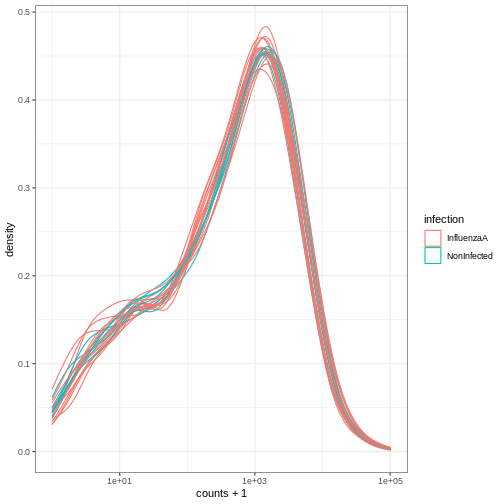

::::::::::::::::::::::::::::::::::::::: objectives

- Bioconductorプロジェクトを紹介してみましょう。
- データコンテナの概念を紹介してみましょう。
- オミックス解析で多用される `SummarizedExperiment` の概要を説明する。

::::::::::::::::::::::::::::::::::::::::::::::::::

:::::::::::::::::::::::::::::::::::::::: questions

- `SummarizedExperiment` とは何でしょうか？
- Bioconductor と何でしょうか？

::::::::::::::::::::::::::::::::::::::::::::::::::

## 次のステップ


バイオインフォマティクスのデータはしばしば複雑です。  これに対処するため、
開発者は、扱う必要のあるデータのプロパティに
マッチする、特別なデータコンテナ（クラスと呼ばれる）を定義する。

この側面は、パッケージ間で同じ**コア・データ・インフラ**を使用する**バイオコンダクター**\[^バイオコンダクター]プロジェクト
。 この
、Bioconductorの成功に貢献したことは間違いない。 Bioconductor パッケージ
開発者は、
プロジェクト全体に一貫性、相互運用性、安定性を提供するために、既存のインフラストラクチャを利用することをお勧めします
。

[^Bioconductor]: Bioconductor](https://www.bioconductor.org)は、
    、
    R言語の生みの親の一人であるロバート・ジェントルマンによって始められた。 Bioconductorは、オミックスデータ
    分析に特化したツールを提供している。 Bioconductorは統計プログラミング言語R（
    ）を使用しており、オープンソース、オープン開発である。

このようなオミックス・データ・コンテナを説明するために、
`SummarizedExperiment`クラスを紹介する。

## 実験概要

下図は、SummarizedExperimentクラスの構造を表しています。


SummarizedExperimentクラスのオブジェクトには、：

- \*\*定量的オミックスデータ
  （発現データ）を含む1つ（または複数）のアッセイ \*\*、マトリックス状のオブジェクトとして格納されている。 特徴（遺伝子、
  転写物、タンパク質、...） は行に沿って定義され、
  は列に沿って定義される。

- データフレームとして格納された、サンプルの共変量を含む **sample metadata** スロット。 この表の行はサンプルを表す（行は発現データの
  列と正確に一致する）。

- データフレームとして格納される、特徴共変量を含む **特徴メタデータ** スロット。 このデータフレームの行は、
  式データの行と完全に一致する。

SummarizedExperiment\`の調整された性質は、データ操作中に
、異なるスロットの次元が
、常に一致することを保証する（すなわち、発現データの列と
サンプルメタデータの行、および発現データと
特徴メタデータの行）。 例えば、
、アッセイから1つのサンプルを除外しなければならない場合、同じ操作でサンプルメタデータから
、自動的に除外される。

メタデータ・スロットは、他の構造に影響を与えることなく、
（カラム）の共変数を追加で増やすことができる。

### SummarizedExperimentの作成

SummarizedExperiment\`を作成するために、
の各コンポーネント、すなわちカウントマトリックス、サンプル、遺伝子
のメタデータをcsvファイルから作成する。 これらは通常、RNA-Seqデータが
（生データが処理された後）提供される方法である。


- **An expression matrix**: カウント行列をロードし、
  最初の列が行/遺伝子名を含むことを指定し、
  `data.frame` を `matrix` に変換する。 ダウンロードは
  [こちら](https://carpentries-incubator.github.io/bioc-intro/data/count_matrix.csv)。


``` r
count_matrix <- read.csv("data/count_matrix.csv",
                         row.names = 1) %>%
    as.matrix()

count_matrix[1:5, ]
```

``` output
        GSM2545336 GSM2545337 GSM2545338 GSM2545339 GSM2545340 GSM2545341
Asl           1170        361        400        586        626        988
Apod         36194      10347       9173      10620      13021      29594
Cyp2d22       4060       1616       1603       1901       2171       3349
Klk6           287        629        641        578        448        195
Fcrls           85        233        244        237        180         38
        GSM2545342 GSM2545343 GSM2545344 GSM2545345 GSM2545346 GSM2545347
Asl            836        535        586        597        938       1035
Apod         24959      13668      13230      15868      27769      34301
Cyp2d22       3122       2008       2254       2277       2985       3452
Klk6           186       1101        537        567        327        233
Fcrls           68        375        199        177         89         67
        GSM2545348 GSM2545349 GSM2545350 GSM2545351 GSM2545352 GSM2545353
Asl            494        481        666        937        803        541
Apod         11258      11812      15816      29242      20415      13682
Cyp2d22       1883       2014       2417       3678       2920       2216
Klk6           742        881        828        250        798        710
Fcrls          300        233        231         81        303        285
        GSM2545354 GSM2545362 GSM2545363 GSM2545380
Asl            473        748        576       1192
Apod         11088      15916      11166      38148
Cyp2d22       1821       2842       2011       4019
Klk6           894        501        598        259
Fcrls          248        179        184         68
```

``` r
dim(count_matrix)
```

``` output
[1] 1474   22
```

- **サンプルを説明する表**、
  [こちら](https://carpentries-incubator.github.io/bioc-intro/data/sample_metadata.csv)。


``` r
sample_metadata <- read.csv("data/sample_metadata.csv")
sample_metadata
```

``` output
       sample     organism age    sex   infection  strain time     tissue mouse
1  GSM2545336 Mus musculus   8 Female  InfluenzaA C57BL/6    8 Cerebellum    14
2  GSM2545337 Mus musculus   8 Female NonInfected C57BL/6    0 Cerebellum     9
3  GSM2545338 Mus musculus   8 Female NonInfected C57BL/6    0 Cerebellum    10
4  GSM2545339 Mus musculus   8 Female  InfluenzaA C57BL/6    4 Cerebellum    15
5  GSM2545340 Mus musculus   8   Male  InfluenzaA C57BL/6    4 Cerebellum    18
6  GSM2545341 Mus musculus   8   Male  InfluenzaA C57BL/6    8 Cerebellum     6
7  GSM2545342 Mus musculus   8 Female  InfluenzaA C57BL/6    8 Cerebellum     5
8  GSM2545343 Mus musculus   8   Male NonInfected C57BL/6    0 Cerebellum    11
9  GSM2545344 Mus musculus   8 Female  InfluenzaA C57BL/6    4 Cerebellum    22
10 GSM2545345 Mus musculus   8   Male  InfluenzaA C57BL/6    4 Cerebellum    13
11 GSM2545346 Mus musculus   8   Male  InfluenzaA C57BL/6    8 Cerebellum    23
12 GSM2545347 Mus musculus   8   Male  InfluenzaA C57BL/6    8 Cerebellum    24
13 GSM2545348 Mus musculus   8 Female NonInfected C57BL/6    0 Cerebellum     8
14 GSM2545349 Mus musculus   8   Male NonInfected C57BL/6    0 Cerebellum     7
15 GSM2545350 Mus musculus   8   Male  InfluenzaA C57BL/6    4 Cerebellum     1
16 GSM2545351 Mus musculus   8 Female  InfluenzaA C57BL/6    8 Cerebellum    16
17 GSM2545352 Mus musculus   8 Female  InfluenzaA C57BL/6    4 Cerebellum    21
18 GSM2545353 Mus musculus   8 Female NonInfected C57BL/6    0 Cerebellum     4
19 GSM2545354 Mus musculus   8   Male NonInfected C57BL/6    0 Cerebellum     2
20 GSM2545362 Mus musculus   8 Female  InfluenzaA C57BL/6    4 Cerebellum    20
21 GSM2545363 Mus musculus   8   Male  InfluenzaA C57BL/6    4 Cerebellum    12
22 GSM2545380 Mus musculus   8 Female  InfluenzaA C57BL/6    8 Cerebellum    19
```

``` r
dim(sample_metadata)
```

``` output
[1] 22  9
```

- **遺伝子を説明する表**、
  [こちら](https://carpentries-incubator.github.io/bioc-intro/data/gene_metadata.csv)。


``` r
gene_metadata <- read.csv("data/gene_metadata.csv")
gene_metadata[1:10, 1:4]
```

``` output
      gene ENTREZID
1      Asl   109900
2     Apod    11815
3  Cyp2d22    56448
4     Klk6    19144
5    Fcrls    80891
6   Slc2a4    20528
7     Exd2    97827
8     Gjc2   118454
9     Plp1    18823
10    Gnb4    14696
                                                                         product
1                                 argininosuccinate lyase, transcript variant X1
2                                         apolipoprotein D, transcript variant 3
3   cytochrome P450, family 2, subfamily d, polypeptide 22, transcript variant 2
4                           kallikrein related-peptidase 6, transcript variant 2
5                  Fc receptor-like S, scavenger receptor, transcript variant X1
6            solute carrier family 2 (facilitated glucose transporter), member 4
7                                          exonuclease 3'-5' domain containing 2
8                            gap junction protein, gamma 2, transcript variant 1
9                           proteolipid protein (myelin) 1, transcript variant 1
10 guanine nucleotide binding protein (G protein), beta 4, transcript variant X2
      ensembl_gene_id
1  ENSMUSG00000025533
2  ENSMUSG00000022548
3  ENSMUSG00000061740
4  ENSMUSG00000050063
5  ENSMUSG00000015852
6  ENSMUSG00000018566
7  ENSMUSG00000032705
8  ENSMUSG00000043448
9  ENSMUSG00000031425
10 ENSMUSG00000027669
```

``` r
dim(gene_metadata)
```

``` output
[1] 1474    9
```

これらのテーブルから `SummarizedExperiment` を作成する：

- として使用されるカウント行列。

- サンプルを記述したテーブルは、**サンプル
  メタデータ**スロットとして使用される。

- 遺伝子を記述したテーブルは、**features
  メタデータ**スロットとして使用される。

これを行うには、
`SummarizedExperiment` コンストラクタを使って、異なるパーツをまとめることができる：


``` r
## BiocManager::install("SummarizedExperiment")
library("SummarizedExperiment")
```

まず、
カウントマトリックスとサンプルアノテーションにおいて、サンプルの順番が同じであることを確認する。また、
カウントマトリックスと遺伝子アノテーションにおいて、遺伝子の順番が同じであることを確認する。


``` r
stopifnot(rownames(count_matrix) == gene_metadata$gene)
stopifnot(colnames(count_matrix) == sample_metadata$sample)
```


``` r
se <- SummarizedExperiment(assays = list(counts = count_matrix),
                           colData = sample_metadata,
                           rowData = gene_metadata)
se
```

``` output
class: SummarizedExperiment 
dim: 1474 22 
metadata(0):
assays(1): counts
rownames(1474): Asl Apod ... Lmx1a Pbx1
rowData names(9): gene ENTREZID ... phenotype_description
  hsapiens_homolog_associated_gene_name
colnames(22): GSM2545336 GSM2545337 ... GSM2545363 GSM2545380
colData names(9): sample organism ... tissue mouse
```

### データの保存

以前のエピソードで行ったように、データをスプレッドシートにエクスポートするには、
、第1章
（小数点以下の区切り文字に`,`と`.`を使った場合の不整合の可能性、
変数型の定義の欠如）で説明したようないくつかの制限がある。 さらに、
スプレッドシートへのデータエクスポートは、データフレーム
や行列のような長方形のデータにのみ関係する。

データを保存するより一般的な方法は、Rに特有であり、
どのオペレーティングシステムでも動作することが保証されている `saveRDS`
関数を使用することである。 このようにオブジェクトを保存すると、ディスク上にバイナリ
表現が生成されます（ここでは `rds` ファイル拡張子を使用します）。
`readRDS` 関数を使用して R にロードし直すことができます。


``` r
saveRDS(se, file = "data_output/se.rds")
rm(se)
se <- readRDS("data_output/se.rds")
head(se)
```

結論として、Rからデータを保存し、
Rで再度ロードする場合、`saveRDS`と`readRDS`で保存とロードを行うのが
。 表形式のデータを、Rを使用していない誰か（
）と共有する必要がある場合は、テキストベースのスプレッドシートにエクスポートするのが、
良い選択肢である。

このデータ構造を使って、
`assay`関数で発現行列にアクセスすることができる：


``` r
head(assay(se))
```

``` output
        GSM2545336 GSM2545337 GSM2545338 GSM2545339 GSM2545340 GSM2545341
Asl           1170        361        400        586        626        988
Apod         36194      10347       9173      10620      13021      29594
Cyp2d22       4060       1616       1603       1901       2171       3349
Klk6           287        629        641        578        448        195
Fcrls           85        233        244        237        180         38
Slc2a4         782        231        248        265        313        786
        GSM2545342 GSM2545343 GSM2545344 GSM2545345 GSM2545346 GSM2545347
Asl            836        535        586        597        938       1035
Apod         24959      13668      13230      15868      27769      34301
Cyp2d22       3122       2008       2254       2277       2985       3452
Klk6           186       1101        537        567        327        233
Fcrls           68        375        199        177         89         67
Slc2a4         528        249        266        357        654        693
        GSM2545348 GSM2545349 GSM2545350 GSM2545351 GSM2545352 GSM2545353
Asl            494        481        666        937        803        541
Apod         11258      11812      15816      29242      20415      13682
Cyp2d22       1883       2014       2417       3678       2920       2216
Klk6           742        881        828        250        798        710
Fcrls          300        233        231         81        303        285
Slc2a4         271        304        349        715        513        320
        GSM2545354 GSM2545362 GSM2545363 GSM2545380
Asl            473        748        576       1192
Apod         11088      15916      11166      38148
Cyp2d22       1821       2842       2011       4019
Klk6           894        501        598        259
Fcrls          248        179        184         68
Slc2a4         248        350        317        796
```

``` r
dim(assay(se))
```

``` output
[1] 1474   22
```

colData\`関数を使ってサンプルのメタデータにアクセスすることができる：


``` r
colData(se)
```

``` output
DataFrame with 22 rows and 9 columns
                sample     organism       age         sex   infection
           <character>  <character> <integer> <character> <character>
GSM2545336  GSM2545336 Mus musculus         8      Female  InfluenzaA
GSM2545337  GSM2545337 Mus musculus         8      Female NonInfected
GSM2545338  GSM2545338 Mus musculus         8      Female NonInfected
GSM2545339  GSM2545339 Mus musculus         8      Female  InfluenzaA
GSM2545340  GSM2545340 Mus musculus         8        Male  InfluenzaA
...                ...          ...       ...         ...         ...
GSM2545353  GSM2545353 Mus musculus         8      Female NonInfected
GSM2545354  GSM2545354 Mus musculus         8        Male NonInfected
GSM2545362  GSM2545362 Mus musculus         8      Female  InfluenzaA
GSM2545363  GSM2545363 Mus musculus         8        Male  InfluenzaA
GSM2545380  GSM2545380 Mus musculus         8      Female  InfluenzaA
                strain      time      tissue     mouse
           <character> <integer> <character> <integer>
GSM2545336     C57BL/6         8  Cerebellum        14
GSM2545337     C57BL/6         0  Cerebellum         9
GSM2545338     C57BL/6         0  Cerebellum        10
GSM2545339     C57BL/6         4  Cerebellum        15
GSM2545340     C57BL/6         4  Cerebellum        18
...                ...       ...         ...       ...
GSM2545353     C57BL/6         0  Cerebellum         4
GSM2545354     C57BL/6         0  Cerebellum         2
GSM2545362     C57BL/6         4  Cerebellum        20
GSM2545363     C57BL/6         4  Cerebellum        12
GSM2545380     C57BL/6         8  Cerebellum        19
```

``` r
dim(colData(se))
```

``` output
[1] 22  9
```

また、`rowData`関数を使ってフィーチャーのメタデータにアクセスすることもできる：


``` r
head(rowData(se))
```

``` output
DataFrame with 6 rows and 9 columns
               gene  ENTREZID                product    ensembl_gene_id
        <character> <integer>            <character>        <character>
Asl             Asl    109900 argininosuccinate ly.. ENSMUSG00000025533
Apod           Apod     11815 apolipoprotein D, tr.. ENSMUSG00000022548
Cyp2d22     Cyp2d22     56448 cytochrome P450, fam.. ENSMUSG00000061740
Klk6           Klk6     19144 kallikrein related-p.. ENSMUSG00000050063
Fcrls         Fcrls     80891 Fc receptor-like S, .. ENSMUSG00000015852
Slc2a4       Slc2a4     20528 solute carrier famil.. ENSMUSG00000018566
        external_synonym chromosome_name   gene_biotype  phenotype_description
             <character>     <character>    <character>            <character>
Asl        2510006M18Rik               5 protein_coding abnormal circulating..
Apod                  NA              16 protein_coding abnormal lipid homeo..
Cyp2d22             2D22              15 protein_coding abnormal skin morpho..
Klk6                Bssp               7 protein_coding abnormal cytokine le..
Fcrls      2810439C17Rik               3 protein_coding decreased CD8-positi..
Slc2a4            Glut-4              11 protein_coding abnormal circulating..
        hsapiens_homolog_associated_gene_name
                                  <character>
Asl                                       ASL
Apod                                     APOD
Cyp2d22                                CYP2D6
Klk6                                     KLK6
Fcrls                                   FCRL2
Slc2a4                                 SLC2A4
```

``` r
dim(rowData(se))
```

``` output
[1] 1474    9
```

### SummarizedExperimentをサブセットする

SummarizedExperiment は、データフレームと同じように、
数値または論理の文字でサブセットできる。

以下では、
、3つの最初のサンプルの5つの最初の特徴のみを含む、SummarizedExperimentクラスの新しいインスタンスを作成します。


``` r
se1 <- se[1:5, 1:3]
se1
```

``` output
class: SummarizedExperiment 
dim: 5 3 
metadata(0):
assays(1): counts
rownames(5): Asl Apod Cyp2d22 Klk6 Fcrls
rowData names(9): gene ENTREZID ... phenotype_description
  hsapiens_homolog_associated_gene_name
colnames(3): GSM2545336 GSM2545337 GSM2545338
colData names(9): sample organism ... tissue mouse
```


``` r
colData(se1)
```

``` output
DataFrame with 3 rows and 9 columns
                sample     organism       age         sex   infection
           <character>  <character> <integer> <character> <character>
GSM2545336  GSM2545336 Mus musculus         8      Female  InfluenzaA
GSM2545337  GSM2545337 Mus musculus         8      Female NonInfected
GSM2545338  GSM2545338 Mus musculus         8      Female NonInfected
                strain      time      tissue     mouse
           <character> <integer> <character> <integer>
GSM2545336     C57BL/6         8  Cerebellum        14
GSM2545337     C57BL/6         0  Cerebellum         9
GSM2545338     C57BL/6         0  Cerebellum        10
```

``` r
rowData(se1)
```

``` output
DataFrame with 5 rows and 9 columns
               gene  ENTREZID                product    ensembl_gene_id
        <character> <integer>            <character>        <character>
Asl             Asl    109900 argininosuccinate ly.. ENSMUSG00000025533
Apod           Apod     11815 apolipoprotein D, tr.. ENSMUSG00000022548
Cyp2d22     Cyp2d22     56448 cytochrome P450, fam.. ENSMUSG00000061740
Klk6           Klk6     19144 kallikrein related-p.. ENSMUSG00000050063
Fcrls         Fcrls     80891 Fc receptor-like S, .. ENSMUSG00000015852
        external_synonym chromosome_name   gene_biotype  phenotype_description
             <character>     <character>    <character>            <character>
Asl        2510006M18Rik               5 protein_coding abnormal circulating..
Apod                  NA              16 protein_coding abnormal lipid homeo..
Cyp2d22             2D22              15 protein_coding abnormal skin morpho..
Klk6                Bssp               7 protein_coding abnormal cytokine le..
Fcrls      2810439C17Rik               3 protein_coding decreased CD8-positi..
        hsapiens_homolog_associated_gene_name
                                  <character>
Asl                                       ASL
Apod                                     APOD
Cyp2d22                                CYP2D6
Klk6                                     KLK6
Fcrls                                   FCRL2
```

また、`colData()` 関数を使用して、
サンプルメタデータから何かをサブセットしたり、`rowData()` 関数を使用して、
フィーチャーメタデータから何かをサブセットすることもできます。  例えば、ここではmiRNAと
に感染していないサンプルだけを残している：


``` r
se1 <- se[rowData(se)$gene_biotype == "miRNA",
          colData(se)$infection == "NonInfected"]
se1
```

``` output
class: SummarizedExperiment 
dim: 7 7 
metadata(0):
assays(1): counts
rownames(7): Mir1901 Mir378a ... Mir128-1 Mir7682
rowData names(9): gene ENTREZID ... phenotype_description
  hsapiens_homolog_associated_gene_name
colnames(7): GSM2545337 GSM2545338 ... GSM2545353 GSM2545354
colData names(9): sample organism ... tissue mouse
```

``` r
assay(se1)
```

``` output
         GSM2545337 GSM2545338 GSM2545343 GSM2545348 GSM2545349 GSM2545353
Mir1901          45         44         74         55         68         33
Mir378a          11          7          9          4         12          4
Mir133b           4          6          5          4          6          7
Mir30c-2         10          6         16         12          8         17
Mir149            1          2          0          0          0          0
Mir128-1          4          1          2          2          1          2
Mir7682           2          0          4          1          3          5
         GSM2545354
Mir1901          60
Mir378a           8
Mir133b           3
Mir30c-2         15
Mir149            2
Mir128-1          1
Mir7682           5
```

``` r
colData(se1)
```

``` output
DataFrame with 7 rows and 9 columns
                sample     organism       age         sex   infection
           <character>  <character> <integer> <character> <character>
GSM2545337  GSM2545337 Mus musculus         8      Female NonInfected
GSM2545338  GSM2545338 Mus musculus         8      Female NonInfected
GSM2545343  GSM2545343 Mus musculus         8        Male NonInfected
GSM2545348  GSM2545348 Mus musculus         8      Female NonInfected
GSM2545349  GSM2545349 Mus musculus         8        Male NonInfected
GSM2545353  GSM2545353 Mus musculus         8      Female NonInfected
GSM2545354  GSM2545354 Mus musculus         8        Male NonInfected
                strain      time      tissue     mouse
           <character> <integer> <character> <integer>
GSM2545337     C57BL/6         0  Cerebellum         9
GSM2545338     C57BL/6         0  Cerebellum        10
GSM2545343     C57BL/6         0  Cerebellum        11
GSM2545348     C57BL/6         0  Cerebellum         8
GSM2545349     C57BL/6         0  Cerebellum         7
GSM2545353     C57BL/6         0  Cerebellum         4
GSM2545354     C57BL/6         0  Cerebellum         2
```

``` r
rowData(se1)
```

``` output
DataFrame with 7 rows and 9 columns
                gene  ENTREZID        product    ensembl_gene_id
         <character> <integer>    <character>        <character>
Mir1901      Mir1901 100316686  microRNA 1901 ENSMUSG00000084565
Mir378a      Mir378a    723889  microRNA 378a ENSMUSG00000105200
Mir133b      Mir133b    723817  microRNA 133b ENSMUSG00000065480
Mir30c-2    Mir30c-2    723964 microRNA 30c-2 ENSMUSG00000065567
Mir149        Mir149    387167   microRNA 149 ENSMUSG00000065470
Mir128-1    Mir128-1    387147 microRNA 128-1 ENSMUSG00000065520
Mir7682      Mir7682 102466847  microRNA 7682 ENSMUSG00000106406
         external_synonym chromosome_name gene_biotype  phenotype_description
              <character>     <character>  <character>            <character>
Mir1901          Mirn1901              18        miRNA                     NA
Mir378a           Mirn378              18        miRNA abnormal mitochondri..
Mir133b          mir 133b               1        miRNA no abnormal phenotyp..
Mir30c-2        mir 30c-2               1        miRNA                     NA
Mir149            Mirn149               1        miRNA increased circulatin..
Mir128-1          Mirn128               1        miRNA no abnormal phenotyp..
Mir7682      mmu-mir-7682               1        miRNA                     NA
         hsapiens_homolog_associated_gene_name
                                   <character>
Mir1901                                     NA
Mir378a                                MIR378A
Mir133b                                MIR133B
Mir30c-2                               MIR30C2
Mir149                                      NA
Mir128-1                              MIR128-1
Mir7682                                     NA
```

<!--For the following exercise, you should download the SE.rda object
(that contains the `se` object), and open the file using the 'load()'
function.-->

<!-- ```{r, eval = FALSE, echo = FALSE} -->

<!-- download.file(url = "https://raw.githubusercontent.com/UCLouvain-CBIO/bioinfo-training-01-intro-r/master/data/SE.rda", -->

<!--               destfile = "data/SE.rda") -->

<!-- load("data/SE.rda") -->

<!-- ``` -->

:::::::::::::::::::::::::::::::::::::::  challenge

## チャレンジ

時刻0と時刻8のサンプル
、最初の3遺伝子の遺伝子発現レベルを抽出する。

:::::::::::::::  solution

## ソリューション


``` r
assay(se)[1:3, colData(se)$time != 4]
```

``` output
        GSM2545336 GSM2545337 GSM2545338 GSM2545341 GSM2545342 GSM2545343
Asl           1170        361        400        988        836        535
Apod         36194      10347       9173      29594      24959      13668
Cyp2d22       4060       1616       1603       3349       3122       2008
        GSM2545346 GSM2545347 GSM2545348 GSM2545349 GSM2545351 GSM2545353
Asl            938       1035        494        481        937        541
Apod         27769      34301      11258      11812      29242      13682
Cyp2d22       2985       3452       1883       2014       3678       2216
        GSM2545354 GSM2545380
Asl            473       1192
Apod         11088      38148
Cyp2d22       1821       4019
```

``` r
# Equivalent to
assay(se)[1:3, colData(se)$time == 0 | colData(se)$time == 8]
```

``` output
        GSM2545336 GSM2545337 GSM2545338 GSM2545341 GSM2545342 GSM2545343
Asl           1170        361        400        988        836        535
Apod         36194      10347       9173      29594      24959      13668
Cyp2d22       4060       1616       1603       3349       3122       2008
        GSM2545346 GSM2545347 GSM2545348 GSM2545349 GSM2545351 GSM2545353
Asl            938       1035        494        481        937        541
Apod         27769      34301      11258      11812      29242      13682
Cyp2d22       2985       3452       1883       2014       3678       2216
        GSM2545354 GSM2545380
Asl            473       1192
Apod         11088      38148
Cyp2d22       1821       4019
```

:::::::::::::::::::::::::

::::::::::::::::::::::::::::::::::::::::::::::::::

:::::::::::::::::::::::::::::::::::::::  challenge

## チャレンジ

長い`rna`テーブルを使用して同じ値が得られることを確認する。

:::::::::::::::  solution

## ソリューション


``` r
rna |>
    filter(gene %in% c("Asl", "Apod", "Cyd2d22"))|>
    filter(time != 4) |> select(expression)
```

``` output
# A tibble: 28 × 1
   expression
        <dbl>
 1       1170
 2      36194
 3        361
 4      10347
 5        400
 6       9173
 7        988
 8      29594
 9        836
10      24959
# ℹ 18 more rows
```

:::::::::::::::::::::::::

::::::::::::::::::::::::::::::::::::::::::::::::::

長いテーブルと`SummarizedExperiment`は同じ
情報を含むが、単に構造が異なるだけである。 各アプローチにはそれぞれ
独自の利点がある。前者は `tidyverse` パッケージに適しており、
一方、後者は多くのバイオインフォマティクスと
統計処理ステップに適した構造である。 例えば、
`DESeq2`パッケージを使用した典型的なRNA-Seq分析である。

#### メタデータに変数を追加する

メタデータに情報を追加することもできる。
サンプルが採取されたセンターを追加したいとします...


``` r
colData(se)$center <- rep("University of Illinois", nrow(colData(se)))
colData(se)
```

``` output
DataFrame with 22 rows and 10 columns
                sample     organism       age         sex   infection
           <character>  <character> <integer> <character> <character>
GSM2545336  GSM2545336 Mus musculus         8      Female  InfluenzaA
GSM2545337  GSM2545337 Mus musculus         8      Female NonInfected
GSM2545338  GSM2545338 Mus musculus         8      Female NonInfected
GSM2545339  GSM2545339 Mus musculus         8      Female  InfluenzaA
GSM2545340  GSM2545340 Mus musculus         8        Male  InfluenzaA
...                ...          ...       ...         ...         ...
GSM2545353  GSM2545353 Mus musculus         8      Female NonInfected
GSM2545354  GSM2545354 Mus musculus         8        Male NonInfected
GSM2545362  GSM2545362 Mus musculus         8      Female  InfluenzaA
GSM2545363  GSM2545363 Mus musculus         8        Male  InfluenzaA
GSM2545380  GSM2545380 Mus musculus         8      Female  InfluenzaA
                strain      time      tissue     mouse                 center
           <character> <integer> <character> <integer>            <character>
GSM2545336     C57BL/6         8  Cerebellum        14 University of Illinois
GSM2545337     C57BL/6         0  Cerebellum         9 University of Illinois
GSM2545338     C57BL/6         0  Cerebellum        10 University of Illinois
GSM2545339     C57BL/6         4  Cerebellum        15 University of Illinois
GSM2545340     C57BL/6         4  Cerebellum        18 University of Illinois
...                ...       ...         ...       ...                    ...
GSM2545353     C57BL/6         0  Cerebellum         4 University of Illinois
GSM2545354     C57BL/6         0  Cerebellum         2 University of Illinois
GSM2545362     C57BL/6         4  Cerebellum        20 University of Illinois
GSM2545363     C57BL/6         4  Cerebellum        12 University of Illinois
GSM2545380     C57BL/6         8  Cerebellum        19 University of Illinois
```

これは、メタデータ・スロットが、
、他の構造に影響を与えることなく、無限に成長できることを示している！

### tidySummarizedExperiment

`SummarizedExperiment` オブジェクトを操作するために tidyverse コマンドを使うことはできるのだろうか？
`tidySummarizedExperiment` パッケージを使えば可能です。

SummarizedExperimentオブジェクトがどのようなものか思い出してください：


``` r
シー
```

``` error
Error: object 'シー' not found
```

tidySummarizedExperiment\`をロードし、seオブジェクト
。


``` r
#BiocManager::install("tidySummarizedExperiment")
library("tidySummarizedExperiment")

se
```

``` output
# A SummarizedExperiment-tibble abstraction: 32,428 × 22
# Features=1474 | Samples=22 | Assays=counts
   .feature .sample    counts sample organism   age sex   infection strain  time
   <chr>    <chr>       <int> <chr>  <chr>    <int> <chr> <chr>     <chr>  <int>
 1 Asl      GSM2545336   1170 GSM25… Mus mus…     8 Fema… Influenz… C57BL…     8
 2 Apod     GSM2545336  36194 GSM25… Mus mus…     8 Fema… Influenz… C57BL…     8
 3 Cyp2d22  GSM2545336   4060 GSM25… Mus mus…     8 Fema… Influenz… C57BL…     8
 4 Klk6     GSM2545336    287 GSM25… Mus mus…     8 Fema… Influenz… C57BL…     8
 5 Fcrls    GSM2545336     85 GSM25… Mus mus…     8 Fema… Influenz… C57BL…     8
 6 Slc2a4   GSM2545336    782 GSM25… Mus mus…     8 Fema… Influenz… C57BL…     8
 7 Exd2     GSM2545336   1619 GSM25… Mus mus…     8 Fema… Influenz… C57BL…     8
 8 Gjc2     GSM2545336    288 GSM25… Mus mus…     8 Fema… Influenz… C57BL…     8
 9 Plp1     GSM2545336  43217 GSM25… Mus mus…     8 Fema… Influenz… C57BL…     8
10 Gnb4     GSM2545336   1071 GSM25… Mus mus…     8 Fema… Influenz… C57BL…     8
# ℹ 40 more rows
# ℹ 12 more variables: tissue <chr>, mouse <int>, center <chr>, gene <chr>,
#   ENTREZID <int>, product <chr>, ensembl_gene_id <chr>,
#   external_synonym <chr>, chromosome_name <chr>, gene_biotype <chr>,
#   phenotype_description <chr>, hsapiens_homolog_associated_gene_name <chr>
```

これはまだ`SummarizedExperiment`オブジェクトなので、効率的な
構造を維持しているが、これでティブルとして見ることができる。
の最初の行に注目してほしい。出力にはこう書いてあるが、これは `SummarizedExperiment`-`tibble`
の抽象化である。 また、出力の2行目には、
のトランスクリプトとサンプルの数を見ることができる。

標準の`SummarizedExperiment`ビューに戻したい場合は、
。


``` r
options("restore_SummarizedExperiment_show" = TRUE)
se
```

``` output
class: SummarizedExperiment 
dim: 1474 22 
metadata(0):
assays(1): counts
rownames(1474): Asl Apod ... Lmx1a Pbx1
rowData names(9): gene ENTREZID ... phenotype_description
  hsapiens_homolog_associated_gene_name
colnames(22): GSM2545336 GSM2545337 ... GSM2545363 GSM2545380
colData names(10): sample organism ... mouse center
```

しかし、ここではティブル・ビューを使う。


``` r
options("restore_SummarizedExperiment_show" = FALSE)
se
```

``` output
# A SummarizedExperiment-tibble abstraction: 32,428 × 22
# Features=1474 | Samples=22 | Assays=counts
   .feature .sample    counts sample organism   age sex   infection strain  time
   <chr>    <chr>       <int> <chr>  <chr>    <int> <chr> <chr>     <chr>  <int>
 1 Asl      GSM2545336   1170 GSM25… Mus mus…     8 Fema… Influenz… C57BL…     8
 2 Apod     GSM2545336  36194 GSM25… Mus mus…     8 Fema… Influenz… C57BL…     8
 3 Cyp2d22  GSM2545336   4060 GSM25… Mus mus…     8 Fema… Influenz… C57BL…     8
 4 Klk6     GSM2545336    287 GSM25… Mus mus…     8 Fema… Influenz… C57BL…     8
 5 Fcrls    GSM2545336     85 GSM25… Mus mus…     8 Fema… Influenz… C57BL…     8
 6 Slc2a4   GSM2545336    782 GSM25… Mus mus…     8 Fema… Influenz… C57BL…     8
 7 Exd2     GSM2545336   1619 GSM25… Mus mus…     8 Fema… Influenz… C57BL…     8
 8 Gjc2     GSM2545336    288 GSM25… Mus mus…     8 Fema… Influenz… C57BL…     8
 9 Plp1     GSM2545336  43217 GSM25… Mus mus…     8 Fema… Influenz… C57BL…     8
10 Gnb4     GSM2545336   1071 GSM25… Mus mus…     8 Fema… Influenz… C57BL…     8
# ℹ 40 more rows
# ℹ 12 more variables: tissue <chr>, mouse <int>, center <chr>, gene <chr>,
#   ENTREZID <int>, product <chr>, ensembl_gene_id <chr>,
#   external_synonym <chr>, chromosome_name <chr>, gene_biotype <chr>,
#   phenotype_description <chr>, hsapiens_homolog_associated_gene_name <chr>
```

`SummarizedExperiment` オブジェクトと対話するために、tidyverse コマンドを使用できるようになりました。

filter\`を使用すると、条件を使って行をフィルタリングすることができる。例えば、
、あるサンプルのすべての行を表示することができる。


``` r
se %>% filter(.sample == "GSM2545336")
```

``` output
# A SummarizedExperiment-tibble abstraction: 1,474 × 22
# Features=1474 | Samples=1 | Assays=counts
   .feature .sample    counts sample organism   age sex   infection strain  time
   <chr>    <chr>       <int> <chr>  <chr>    <int> <chr> <chr>     <chr>  <int>
 1 Asl      GSM2545336   1170 GSM25… Mus mus…     8 Fema… Influenz… C57BL…     8
 2 Apod     GSM2545336  36194 GSM25… Mus mus…     8 Fema… Influenz… C57BL…     8
 3 Cyp2d22  GSM2545336   4060 GSM25… Mus mus…     8 Fema… Influenz… C57BL…     8
 4 Klk6     GSM2545336    287 GSM25… Mus mus…     8 Fema… Influenz… C57BL…     8
 5 Fcrls    GSM2545336     85 GSM25… Mus mus…     8 Fema… Influenz… C57BL…     8
 6 Slc2a4   GSM2545336    782 GSM25… Mus mus…     8 Fema… Influenz… C57BL…     8
 7 Exd2     GSM2545336   1619 GSM25… Mus mus…     8 Fema… Influenz… C57BL…     8
 8 Gjc2     GSM2545336    288 GSM25… Mus mus…     8 Fema… Influenz… C57BL…     8
 9 Plp1     GSM2545336  43217 GSM25… Mus mus…     8 Fema… Influenz… C57BL…     8
10 Gnb4     GSM2545336   1071 GSM25… Mus mus…     8 Fema… Influenz… C57BL…     8
# ℹ 40 more rows
# ℹ 12 more variables: tissue <chr>, mouse <int>, center <chr>, gene <chr>,
#   ENTREZID <int>, product <chr>, ensembl_gene_id <chr>,
#   external_synonym <chr>, chromosome_name <chr>, gene_biotype <chr>,
#   phenotype_description <chr>, hsapiens_homolog_associated_gene_name <chr>
```

select\`を使って表示したいカラムを指定することができる。


``` r
se %>% select(.sample)
```

``` output
tidySummarizedExperiment says: Key columns are missing. A data frame is returned for independent data analysis.
```

``` output
# A tibble: 32,428 × 1
   .sample   
   <chr>     
 1 GSM2545336
 2 GSM2545336
 3 GSM2545336
 4 GSM2545336
 5 GSM2545336
 6 GSM2545336
 7 GSM2545336
 8 GSM2545336
 9 GSM2545336
10 GSM2545336
# ℹ 32,418 more rows
```

mutate\`を使ってメタデータ情報を追加することができる。


``` r
se %>% mutate(center = "ハイデルベルク大学")
```

``` output
# A SummarizedExperiment-tibble abstraction: 32,428 × 22
# Features=1474 | Samples=22 | Assays=counts
   .feature .sample    counts sample organism   age sex   infection strain  time
   <chr>    <chr>       <int> <chr>  <chr>    <int> <chr> <chr>     <chr>  <int>
 1 Asl      GSM2545336   1170 GSM25… Mus mus…     8 Fema… Influenz… C57BL…     8
 2 Apod     GSM2545336  36194 GSM25… Mus mus…     8 Fema… Influenz… C57BL…     8
 3 Cyp2d22  GSM2545336   4060 GSM25… Mus mus…     8 Fema… Influenz… C57BL…     8
 4 Klk6     GSM2545336    287 GSM25… Mus mus…     8 Fema… Influenz… C57BL…     8
 5 Fcrls    GSM2545336     85 GSM25… Mus mus…     8 Fema… Influenz… C57BL…     8
 6 Slc2a4   GSM2545336    782 GSM25… Mus mus…     8 Fema… Influenz… C57BL…     8
 7 Exd2     GSM2545336   1619 GSM25… Mus mus…     8 Fema… Influenz… C57BL…     8
 8 Gjc2     GSM2545336    288 GSM25… Mus mus…     8 Fema… Influenz… C57BL…     8
 9 Plp1     GSM2545336  43217 GSM25… Mus mus…     8 Fema… Influenz… C57BL…     8
10 Gnb4     GSM2545336   1071 GSM25… Mus mus…     8 Fema… Influenz… C57BL…     8
# ℹ 40 more rows
# ℹ 12 more variables: tissue <chr>, mouse <int>, center <chr>, gene <chr>,
#   ENTREZID <int>, product <chr>, ensembl_gene_id <chr>,
#   external_synonym <chr>, chromosome_name <chr>, gene_biotype <chr>,
#   phenotype_description <chr>, hsapiens_homolog_associated_gene_name <chr>
```

tidyverseパイプ `%>%` を使ってコマンドを組み合わせることもできます。
の例では、`group_by` と `summarise` を組み合わせて、各サンプルの
カウントの合計を得ることができる。


``` r
se %>%
    group_by(.sample) %>%
    summarise(total_counts=sum(counts))
```

``` output
tidySummarizedExperiment says: A data frame is returned for independent data analysis.
```

``` output
# A tibble: 22 × 2
   .sample    total_counts
   <chr>             <int>
 1 GSM2545336      3039671
 2 GSM2545337      2602360
 3 GSM2545338      2458618
 4 GSM2545339      2500082
 5 GSM2545340      2479024
 6 GSM2545341      2413723
 7 GSM2545342      2349728
 8 GSM2545343      3105652
 9 GSM2545344      2524137
10 GSM2545345      2506038
# ℹ 12 more rows
```

整頓されたSummarizedExperimentオブジェクトを、プロット用の通常のtibble
として扱うことができる。

ここでは、サンプルごとのカウント数分布をプロットしている。


``` r
se %>%
    ggplot(aes(counts + 1, group=.sample, color=infection))+
    geom_density() +
    scale_x_log10() +
    theme_bw()
```



tidySummarizedExperimentの詳細については、パッケージ
ウェブサイト
[こちら](https://stemangiola.github.io/tidySummarizedExperiment/)を参照してください。

\*\*テイクホーム・メッセージ

- SummarizedExperiment\`は、オミックスデータを効率的に保存し、
  。

- これらは多くのBioconductorパッケージで使用されている。

RNAシーケンス解析に焦点を当てた次のトレーニング、
、Bioconductor `DESeq2`パッケージを使って、
差分発現解析を行う方法を学ぶ。  DESeq2`パッケージの全解析は`SummarizedExperiment\` で処理される。

:::::::::::::::::::::::::::::::::::::::: keypoints

- Bioconductorは、ハイスループットな生物学データの理解（
  ）のためのサポートとパッケージを提供するプロジェクトである。
- SummarizedExperiment\`は、ハイスループットのオミックスデータを保存し、
  管理するのに便利なオブジェクトの一種である。

::::::::::::::::::::::::::::::::::::::::::::::::::
